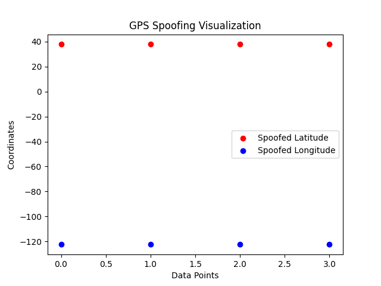

# GPS Spoofing Detection Project

## Overview
This project demonstrates a practical application of cybersecurity and data analysis by simulating GPS spoofing attacks, detecting anomalies, and visualizing spoofed GPS data. The project is designed to showcase skills in Python programming, anomaly detection, and data visualization.

---

## Features
- **GPS Spoofing Simulation**:
  - Alters genuine GPS coordinates to simulate spoofing attacks.
- **Anomaly Detection**:
  - Identifies spoofed GPS entries using threshold-based analysis.
- **Data Visualization**:
  - Graphically represents spoofed versus genuine GPS data for better insights.

---

## Results
1. **Detection Accuracy**:
   - The defense mechanism successfully flagged all spoofed entries with a threshold of `0.001`.
2. **Visualization**:
   - A scatter plot highlights significant deviations in spoofed GPS data.

---

## Project Structure
- **Python Scripts**:
  - `gps_spoofing.py`: Simulates GPS spoofing attacks.
  - `gps_defense.py`: Detects spoofed entries.
  - `gps_visualization.py`: Visualizes GPS data anomalies.
- **Datasets**:
  - `gps_data.csv`: Original GPS data.
  - `spoofed_gps_data.csv`: Spoofed GPS data.
  - `defense_results.csv`: Results of the anomaly detection.
- **Results**:
  - `gps_spoofing_visualization.png`: Scatter plot showing spoofed GPS data.

---

## Technologies Used
- **Programming Language**: Python
- **Libraries**: Pandas, Matplotlib
- **Tools**: Data Manipulation and Visualization

---

## How to Run
### Prerequisites
1. Ensure Python 3.x is installed on your machine. You can download it from the [official Python website](https://www.python.org/downloads/).
2. Install the required Python libraries:
   ```bash
   pip install pandas matplotlib
   ```

### Steps
1. **Clone the Repository**:
   - Open a terminal or command prompt and run:
     ```bash
     git clone https://github.com/yourusername/gps-spoofing-detection.git
     cd gps-spoofing-detection
     ```

2. **Set Up the Environment**:
   - Ensure all required libraries are installed:
     ```bash
     pip install pandas matplotlib
     ```

3. **Run the Scripts**:
   - Execute the scripts in the following order:

     1. **Simulate GPS Spoofing**:
        ```bash
        python gps_spoofing.py
        ```
        - This script creates a spoofed GPS dataset named `spoofed_gps_data.csv`.

     2. **Detect Spoofed Entries**:
        ```bash
        python gps_defense.py
        ```
        - This script compares the original and spoofed datasets, marking anomalies in `defense_results.csv`.

     3. **Visualize Results**:
        ```bash
        python gps_visualization.py
        ```
        - This script generates a visualization of spoofed vs. genuine GPS data and saves it as `gps_spoofing_visualization.png`.

4. **Review the Outputs**:
   - Check the generated files:
     - `spoofed_gps_data.csv`: Contains the altered GPS data to simulate spoofing.
     - `defense_results.csv`: Flags spoofed entries (`True` for spoofed).
     - `gps_spoofing_visualization.png`: A scatter plot highlighting GPS spoofing anomalies.

---

## Results Snapshot
### Scatter Plot: Spoofed vs Genuine GPS Data


---

## Future Enhancements
- Incorporate real-world GPS datasets for testing.
- Simulate advanced spoofing techniques, such as signal-based attacks.
- Develop a real-time spoofing detection system.

